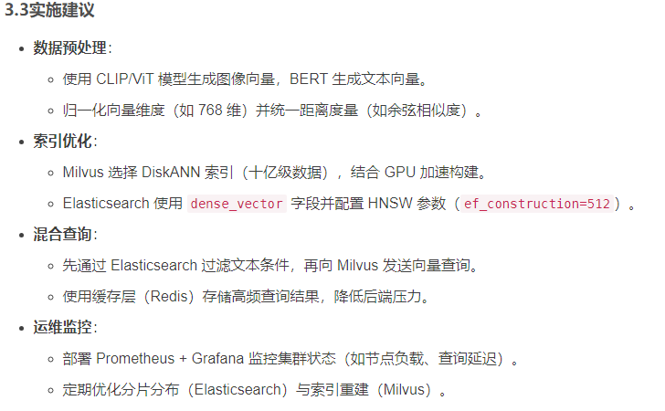

向量数据库是一种专门用于存储和查询高维向量数据的数据库系统。它广泛应用于机器学习、人工智能和相似性搜索等领域。这类数据库能够高效地处理向量之间的距离计算和最近邻搜索，常见应用场景包括：
- ‌推荐系统‌：基于用户行为向量进行商品或内容推荐
- ‌图像检索‌：通过图像特征向量实现相似图片查找
- ‌自然语言处理‌：利用词嵌入或句子嵌入进行语义搜索
- ‌生物信息学‌：处理基因序列等高维生物数据

向量数据库的核心优势在于能够快速执行近似最近邻(ANN)搜索，即使面对海量数据也能保持良好的查询性能。常见的向量数据库产品包括Pinecone、Weaviate、Milvus等。

## 向量数据库究竟做了什么
对一段文本做 Embedding得到的是一个向量，比如说一个由 768 或 1,536 个数字组成的数组，代表该文本的语义含义。相似的文本产生相似的向量。向量数据库将这些向量存储下来并建立索引，以支持快速最近邻搜索。
用户提出问题时，先将问题做 Embedding再向向量数据库发起查询："哪些已存储的向量与之最接近？"数据库返回语义上最相似的文本片段，随后将这些片段注入 LLM 的上下文。
检索环节的好坏直接决定 RAG 系统整体的表现，这一步出了偏差再好的 LLM 也只会给出自信却错误的回答。

# pinecone
## 介绍
Pinecone 是一个托管式的向量数据库服务，专为机器学习和人工智能应用设计。它允许开发者高效地存储、检索和管理高维向量数据，常用于相似性搜索、推荐系统、自然语言处理（NLP）等场景。

在 Pinecone 中，你可以将文本、图像或其他类型的数据转换为向量表示（通常由嵌入模型生成），然后将其存入索引中。之后可以通过查询与某个向量最相似的条目来执行语义搜索或内容推荐等任务。其核心优势在于提供快速的近似最近邻搜索（Approximate Nearest Neighbor Search），并具备云端弹性扩展能力。

此外，Pinecone 提供简洁易用的 API 接口，便于集成进各种应用程序中，使得构建智能搜索功能变得更加简单高效。

全托管云原生向量数据库，提供Serverless架构，支持实时向量相似性搜索和多模态数据处理，集成 OpenAI、Hugging Face 等工具链，无需管理基础设施，适合中小型企业快速部署。

## 服务
提供免费和付费两种套餐。免费: 新用户注册后通常可以获得一定的免费额度（如每月一定数量的向量操作或存储容量），超出部分则按使用量计费。 具体的收费标准会根据 pinecone 官方最新的定价策略而有所调整，建议访问其官网查看详细的价格信息。

# Milvus vs Elasticsearch 7.x
### 若偏向社区活跃度和技术自主可控性，则 Milvus 是目前最受欢迎的选择
由 Zilliz 开发的开源向量数据库，专为大规模相似性搜索设计。支持多种索引结构和 ANN 算法，适用于推荐系统、图像识别等 AI 应用场景。它提供了云原生部署方式，也支持本地化安装
Sparse-BM25 由 Milvus提出，其原理类似 Elasticsearch 和其他全文搜索系统中常用的BM25算法，但针对稀疏向量设计，可以实现相同效果的全文搜索功能：

Milvus 作为性能领先的向量数据库，通过无缝结合语义搜索和全文搜索，将稠密向量搜索与优化的稀疏向量技术相结合，提供了卓越的性能、可扩展性和效率，并简化了基础设施的部署难度，降低成本的同时还增强了搜索能力。 
展望未来，我们相信基于向量数据库的新型基础设施，将有望超越Elasticsearch成为混合搜索的标准解决方案。

### Elasticsearch 7.x
引入了 dense_vector 数据类型和支持 kNN 搜索插件后，也可作为一个轻量级向量搜索引擎选择之一，尤其在已有 ELK 技术栈环境中更易于整合。

### Milvus 与 Elasticsearch 合结使用 - 使用集成工具：
某些集成工具或框架可能支持直接从 Elasticsearch 获取元数据并与 Milvus 的结果结合。例如，使用 Faiss 或者 Annoy 等库在 Python 中结合使用 Elasticsearch 和 Milvus。

### 实战指南：如何用Elasticsearch+Milvus搭建十亿级多模态搜索系统（含性能调优）
https://blog.csdn.net/x8y9z0/article/details/154063532

### Milvus 与 Elasticsearch 的集成案例明显多于 Pinecone 与 Elasticsearch 的集成
- Milvus + ES 的混合架构被广泛推荐用于处理十亿级多模态数据‌。该组合利用 Milvus 专精高维向量检索、<b>ES 强文本与元数据过滤的优势</b>，形成“向量+文本”协同搜索的生产级方案 
- 多篇技术博客和实战指南详细描述了 Milvus 与 Elasticsearch 的集成流程、性能调优及实际部署案例‌，包括分层查询、结果融合等完整链路
- 相比之下，‌Pinecone 与 Elasticsearch 的集成在公开资料中提及较少‌。虽然 Pinecone 支持混合搜索（稀疏+稠密向量），但其作为全托管服务，通常不强调与外部 ES 集成，更多是独立使用
- 有资料明确指出：‌Pinecone 不适合作为文档存储，也不能替代 ES 进行纯关键词检索‌，若需两者结合，需自行实现数据同步，但此类实践案例在公开领域较少见
- Milvus + ES
  - 案例丰富
  - 技术文档详尽
  -  适用于超大规模、高复杂度检索场景
- Pinecone + ES
  -  案例稀少
  - 集成非主流路径
  - Pinecone 更倾向独立使用或对接 Embedding 模型（如 OpenAI）
  - 因此，若关注集成案例的丰富程度和落地实践，‌Milvus 与 Elasticsearch 的组合更具代表性‌。

### # 面向多模态检索的向量数据库对比分析和技术选型 - Elasticsearch、Milvus、Pinecone、FAISS、Chroma、PGVector、Weaviate、Qdrant
- https://asialee.blog.csdn.net/article/details/146051524

# JFaiss + 自建服务
Facebook AI 团队推出的 Faiss 是高效的向量相似度搜索库，虽然不是完整的数据库系统，但很多企业会选择在其基础上封装 RESTful 或 gRPC 接口来自建向量服务平台。
JFaiss 是一个基于 Faiss 开发的 Java 封装库，其底层核心由 C++ 编写，通过 JNI 调用实现 Java 对 Faiss 功能的调用‌。

# 比如 Pinecone、Chroma、Weaviate
- Pinecone 用于生产级规模
- Chroma 用于本地原型开发
- Weaviate 用于混合搜索。

### Chroma - 用于项目实验阶段 
Chroma：从原型开发开始 - Chroma 开源，通过 pip install chromadb 安装，支持本地内存运行或持久化到磁盘，5 分钟内即可搭建一个可用的向量存储。

### Pinecone - 生产
Pinecone 是完全托管的云基础设施——无需自行运行服务器、管理内存或操心副本复制。免费层约可处理 100 万个 1,536 维向量，覆盖多数小型应用绰绰有余；付费层可扩展至数十亿量级。

### Weaviate：用于混合搜索
与纯关键词搜索都不总是最优解。语义搜索会漏掉精确匹配，用户查询"RFC 7519"时，关键词匹配远比语义相似度更快定位到结果。混合搜索将余弦相似度与 BM25 关键词匹配相结合，并对两者施加权重。

### Milvus  - 最火的开源方案
纯语义搜索与纯关键词搜索都不总是最优解。语义搜索会漏掉精确匹配，用户查询"RFC 7519"时，关键词匹配远比语义相似度更快定位到结果。混合搜索将余弦相似度与 BM25 关键词匹配相结合，并对两者施加权重。

# RAG系统中向量检索与LLM协同的完整工作流程图解（输入→检索→融合→生成
### LLM实现查询增强(整个链路实现了"检索增强生成"的核心思想，既发挥了向量搜索的高效性又保留了大模型的理解创造力。

以下是RAG系统的具体实现步骤，涵盖向量数据库查询与LLM协同工作的完整流程：
- 数据预处理阶段：将原始文本切分为段落或句子，通过嵌入模型(如Sentence-BERT)转换为高维向量表示。
- 向量存储阶段：将文本向量及其元数据存入向量数据库(Milvus/Pinecone等)，建立高效的近似最近邻索引结构。
- 查询处理阶段：接收用户自然语言问题，同样经过嵌入模型转化为查询向量。
- 相似性检索阶段：在向量数据库中查找与查询向量最接近的Top-K个候选文档片段。
- 上下文融合阶段：把检索到的相关文档拼接成结构化Prompt模板，附加原始问题形成完整输入。
- LLM推理阶段：将构造后的Prompt送入大语言模型(Qwen/Llama2等)进行理解和内容生成。
- 结果呈现阶段：输出最终回答文本，并记录本次交互的日志用于后续分析和迭代优化。

这种“检索+生成”模式的优势在于：
- ✅ ‌减少幻觉‌：LLM的回答基于真实数据片段
- ✅ ‌可解释性强‌：能追溯答案来源
- ✅ ‌更新灵活‌：只需更新数据库，无需重新训练模型

### 应该使用哪个 Embedding 模型？
OpenAI和google的API都是可以选择的质量可靠，价格低廉（约每百万 Token 0.02 美元），生态支持广泛。本地部署且注重隐私的场景下，通过 Ollama 运行 nomic-embed-text 是最佳免费方案；追求质量上限而不计成本，可选 text-embedding-3-large 或 Cohere 的 embed-v3。

### 第一个项目应该使用哪个向量数据库？
Chroma没有悬念。pip 安装，本地运行，零配置，免费。先用 Chroma 搭建第一个 RAG 系统，日后需要扩展至生产环境，迁移到 Pinecone 或 Weaviate 只需几小时——前提是接口足够干净。

### 做 RAG 一定需要向量数据库吗，还是可以用普通数据库？
PostgreSQL 的 pgvector 扩展可以实现近似最近邻搜索，这是一个可行的生产方案。Supabase（托管式 Postgres）原生支持 pgvector，100 万向量以下的应用表现良好。规模再往上走专用向量数据库在性能上的优势才会真正体现出来。

# AI术语
### CV（Computer Vision，计算机视觉）‌
计算机视觉是人工智能的一个分支，致力于让计算机能够“看懂”图像或视频的内容。它涉及图像识别、目标检测、人脸识别、图像分割等多个方向。常见的应用场景包括自动驾驶汽车识别道路环境、医学影像分析、安防监控等。

### NLP（Natural Language Processing，自然语言处理）‌
自然语言处理旨在使计算机理解和生成人类语言。其核心技术涵盖文本分类、情感分析、机器翻译、问答系统以及对话机器人等。典型的应用案例有智能客服聊天机器人、搜索引擎语义理解、语音助手（如Siri、Alexa）等。

# Prompt Engineering, Context Engineering 与 Harness Engineeringt: 现代AI辅助开发的三层工程实践体系
- https://zhuanlan.zhihu.com/p/2025667582208812643
- https://blog.csdn.net/chenwiehuang/article/details/159549054

### Prompt Engineering（提示工程）‌

在RAG（Retrieval-Augmented Generation）系统中，Prompt Engineering、Context Engineering 和 Harness Engineering 是三个关键环节。它们分别关注输入提示的设计、上下文内容的构造以及整体系统的集成与测试。

#### ‌实践方法：‌
- 明确目标：根据应用场景确定希望模型执行的任务类型（分类、摘要、问答等）。
- 清晰表达指令：确保提示词简洁明了，减少歧义。
- 示例注入：提供少量样本帮助模型理解预期输出格式。
- 角色设定：模拟专家身份进行提问或回复，提高权威感。
- 分步指导：复杂任务可通过逐步分解的方式降低难度。

####  ‌注意事项：‌
- 避免开放式过强导致结果不可控。
- 利用模板化提升效率并保持一致性。
- 动态调整策略应对不同类型查询。

###  Context Engineering（上下文工程）
这部分侧重于检索相关信息并将之整合进提示中，使模型能基于真实知识作答。

#### ‌实践步骤：‌
- 构建索引库：收集领域内的文档资料建立高效的搜索引擎。
- 查询优化：改进用户原始问题使其更适合匹配数据库条目。
- 文档召回：选取最相关的若干段落作为候选背景材料。
- 上下文融合：按优先级拼接文本形成完整的上下文环境。
- 冗余去除：剔除重复或冲突的信息以免干扰判断。

####  ‌关键技术点：‌
- 使用嵌入表示计算相似度。
- 引入时间戳控制时效性。
- 设置权重机制突出重点部分。

### Harness Engineering（平台搭建）
指的是整个 RAG 系统的实际部署及运维管理方式。

#### ‌实施建议：
- 模块划分：把各个子功能封装成服务便于扩展维护。
- 接口规范：统一前后端通信协议方便协作调试。
- 性能监控：记录吞吐量延迟等指标评估服务质量。
- A/B 测试：对比不同参数组合下的表现差异寻找最优解。
- 回滚预案：制定紧急故障恢复计划保障稳定性。

#### ‌工具推荐：
- 后端可用 FastAPI 或 Flask 开发 API。
- 数据存储选择 Elasticsearch / FAISS 加速查找速度。
- 日志追踪借助 ELK Stack 实现全链路分析能力。

综上所述，这三项工程技术相互配合构成了一个高效可靠的增强型语言模型解决方案。实际工作中通常需要反复迭代打磨才能达到理想状态。

